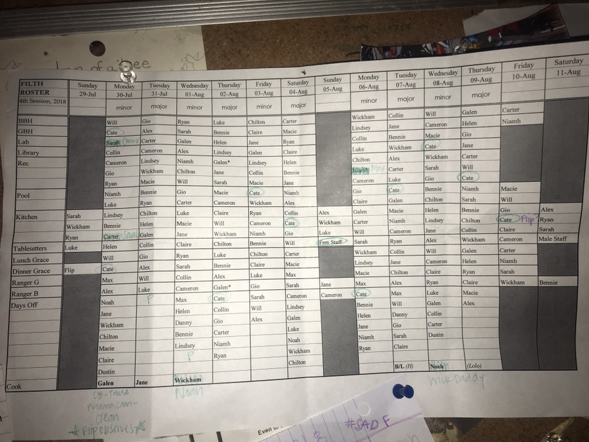

# filth-maker

Previously, the assistant director of Nature Camp had to spend many hours creating the duty sheet (or "filth roster") by hand before every session. This was tedious, and the schedule often contained various errors that had to be corrected later. This program, which is written in HTML and Javascript, will create the filth automatically, hopefully saving future assistant directors many hours of work for years to come.

Here is an example of an old filth roster (created before this program), to give an idea of what the final product of this program will look like.

Things to note:
    -Extra kitchens (i.e. once everyone has already been assigned two kitchens) are random; the program does not favor giving an extra kitchen to people who have it on "half" days like the first or middle Sunday, or the last Saturday.
    -Kitchen is the only duty that is tracked to make sure people don't get it too many times
    -If you want a staff member to be a cook for a certain day, just add them to the DOP that day and they won't be dutied
    -As of 06/16/2022, this program is only compatible with Google Chrome.
    -As of 06/16/2022, you must enter each staff member as either female or male staff. It will not affect how they are assigned duties. This will be updated in the future.
    -As of 06/16/2022, this program does not assign bunkhouse duties or graces at meals, as the gender neutral housing situation is still a work in progress. This program will be updated in the future to work with the updated housing/duty system
    -Staff members that are NOT assigned to a duty on a given day are listed below the DOP section, as "undutied" staffmembers
    -This program does nothing to ensure that someone does not get non-kitchen duties multiple times. For example, someone might get assigned rec four days in a row. The AD can fix
    this manually

TO RUN THIS CODE:

-Go to https://github.com/Will-Lounsbery-Scaife/filth-maker
-Click the green "code" button
-Click "download zip"
-Unzip the downloaded file, and store it in an appropriate location on your computer

-On PC: /n
    -Open the folder that this program is stored in
    -Right click the file "name_entry.html"
    -Open with --> Google Chrome
-On Mac:
    -Open Google Chrome
    -Click file --> open file --> navigate to where this program is stored on your computer --> click "name_entry.html"
-Once you have opened name_entry.html:
    -Type a male staff name in corresponding text box, then click add staff member. Do NOT press enter
    -After you click, write a new name in the blank box below.
    -When you have entered the last name of male staff, you STILL MUST CLICK THE ADD NEW MALE STAFF NAME BUTTON (there should be a blank text box under the last male staff entered)
    -Do the same for female staff, then press submit
-Once you are on the DOP entry form:
    -Select the names of staff members that are off on each day
    -If you would like a staff member to be a cook on a given day, say that they are at the DOP that day to ensure they won't be dutied
    -At the bottom of the page, enter which staff members are lifeguards, then press submit
-Once you are on the page with the filth table:
    -If there is an "XX" next to each person on pool duty on a given day, that means that neither person assigned to pool that day is a lifeguard.
    -If you don't like the filth that was generated, simply press refresh and you will get a brand new one.

If you have any questions, comments, or suggestions, please contact Will Lounsbery-Scaife at will.lounsberyscaife@gmail.com, or at 646 265 3928
    